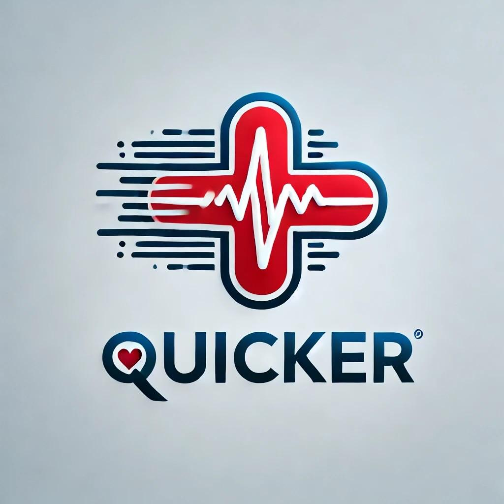

# QuickER: Revolutionizing Emergency Room Efficiency

QuickER is an intelligent, end-to-end solution designed to optimize the emergency response process—from the moment a 911 call is made to when a patient is treated in the ER. By leveraging cutting-edge AI, real-time data processing, and a streamlined dashboard, QuickER transforms how hospitals manage incoming patients and allocate critical resources, ultimately improving patient care and outcomes.

# 🚀 Inspiration

Emergency rooms across the globe face overwhelming levels of overcrowding, which leads to delayed patient care, inefficient resource management, and higher mortality rates. QuickER was developed to address these challenges by streamlining the emergency response process, enabling hospitals to deliver faster, more efficient care from the moment a 911 call is made.

# 🌟 What It Does

QuickER enhances the emergency response pipeline with the following features:

1. **Live 911 Call Analysis**: Transcribes 911 calls in real-time, capturing critical details such as symptoms and emergency information using Twilio and OpenAI Whisper.
2. **Symptom and Condition Prediction**: Predicts medical conditions, recommends treatments, and suggests diagnostic tests based on the transcribed data, powered by LangChain, Llama3.1, and Retrieval Augmented Generation (RAG).
3. **Dashboard Integration**: Displays patient data, ER resources, and predicted medical needs on the QuickER dashboard for healthcare staff to review and act upon.
4. **Resource Allocation**: Pre-allocates resources (e.g., medication, diagnostic rooms, equipment) based on patient needs before arrival.
5. **Patient Routing**: Quickly routes patients upon arrival to minimize wait times and maximize treatment efficiency.

# 🛠️ How We Built It

QuickER consists of several tightly integrated submodules:

1. **911 Call Analysis**:
   - **Twilio** gathers real-time audio from 911 calls.
   - **OpenAI Whisper** converts the audio into accurate transcriptions, even under noisy conditions.
   
2. **Symptom and Condition Prediction**:
   - **LangChain** coordinates the flow of data between components and orchestrates symptom extraction, condition prediction, and treatment suggestions.
   - **Llama3.1** analyzes transcriptions to identify conditions, recommend medications, and suggest diagnostic tests.
   - **RAG** retrieves relevant data from trusted medical textbooks for validation.
   - **Chain of Thought** prompting enhances Llama3.1's reasoning accuracy through multi-step logical processing.
   
3. **QuickER Dashboard**:
   - **Backend (Flask)** handles API integration, real-time data processing, and seamless communication between AI models and the frontend.
   - **Frontend (Next.js + TailwindCSS)** powers a dynamic, user-friendly dashboard that provides healthcare professionals with real-time updates on patient needs and resource availability.

# 💡 Challenges We Overcame

- **Speech-to-Text Accuracy**: Fine-tuned Whisper to handle varying accents and noisy environments with precision.
- **Complex Medical Predictions**: Prompt engineering and model tuning were critical to delivering accurate symptom and treatment predictions.
- **Real-Time Data**: Achieving reliable real-time data integration with fast response times in a high-stakes environment.
- **Scalability**: Adapting the system to handle multiple simultaneous 911 calls and rapidly updating the dashboard for busy ERs.

# 🎉 Accomplishments

- Built a secure, HIPAA-compliant solution that ensures patient data privacy by processing everything locally.
- Successfully integrated multiple complex AI submodules into a seamless workflow.
- Developed a highly responsive and visually appealing dashboard that significantly improves ER efficiency.

# 🧠 What We Learned

- Real-time data processing is essential for emergency healthcare solutions.
- Fine-tuning AI models is crucial for accurate medical predictions.
- Privacy and security measures must be rigorous when handling sensitive patient data.

# 🔮 What’s Next for QuickER

- **Improved Symptom Recognition**: Enhance AI models for better symptom recognition from 911 calls.
- **Scalability to More Hospitals**: Expand the system to support multiple hospitals, including smaller facilities with limited resources.
- **Wearable and IoT Integration**: Use data from patient wearables and IoT devices to provide a more comprehensive health profile.
- **Advanced Resource Prediction**: Predict future resource availability based on real-time usage trends to optimize hospital operations.
- **Emergency Response Coordination**: Extend the system to integrate with ambulance services for end-to-end emergency management.

# 📚 References

1. American College of Emergency Physicians (ACEP). “Emergency Department Crowding.” ACEP.org  
2. *Journal of Emergency Medicine.* “Impact of Emergency Department Crowding on Outcomes of Admitted Patients.”
3. Oxford handbook of emergency medicine (5th ed.). Oxford University Press.
